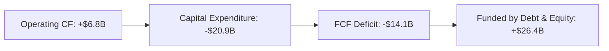

Here is the comprehensive fundamental analysis report for **SPCX (Space Exploration Technologies Corp.)**.

---

# 📊 Comprehensive Fundamental Analysis Report: SPCX (Space Exploration Technologies Corp.)

**Analysis Date:** June 16, 2026  
**Ticker:** SPCX  
**Exchange:** NMS  
**Sector/Industry:** Industrials / Aerospace & Defense  
**Market Capitalization:** ~$2.84 Trillion  

---

## 1. COMPANY OVERVIEW

Space Exploration Technologies Corp. (SpaceX) is a private aerospace manufacturer and space transportation company. Despite its private status, the company trades under the ticker SPCX on NMS. With a market cap of approximately **$2.84 trillion**, it is one of the most valuable companies globally by market capitalization, reflecting the premium investors place on its dominance in space launch, satellite internet (Starlink), and deep-space transport capabilities.

---

## 2. REVENUE & PROFITABILITY ANALYSIS

### Revenue Growth (Strong & Accelerating)

| Period | Revenue | YoY Growth |
|--------|---------|-----------|
| FY 2023 | $10.39B | — |
| FY 2024 | $14.02B | **+34.9%** |
| FY 2025 | $18.67B | **+33.2%** |
| TTM (as of Jun 2026) | **$19.30B** | Continued growth |
| Q1 2026 | $4.69B | **+15.4%** vs Q1 2025 |

**Insight:** Revenue has grown at a ~34% CAGR over the past two years, driven by Starlink subscriber growth, commercial launch contracts (NASA, DoD, private customers), and Dragon missions.

### Gross Margins (Improving)

| Period | Gross Profit | Gross Margin |
|--------|-------------|-------------|
| FY 2023 | $4.28B | 41.2% |
| FY 2024 | $6.02B | 42.9% |
| FY 2025 | $9.22B | **49.4%** |
| Q1 2026 | $2.31B | 49.1% |

**Insight:** Gross margins have improved substantially from ~41% to ~49%, likely driven by the higher-margin Starlink recurring subscription revenue becoming a larger share of the revenue mix.

### Profitability (Deteriorating recently)

| Metric | FY 2023 | FY 2024 | FY 2025 | Q1 2026 |
|--------|---------|---------|---------|---------|
| Operating Income | $507M | $742M | **-$2.06B** | **-$1.95B** |
| Net Income | -$4.63B | $791M | **-$4.94B** | **-$4.28B** |
| EBITDA | -$663M | $5.65B | $4.43B | -$1.16B |
| Normalized EBITDA | $3.35B | $5.92B | $4.95B | -$1.18B |

**⚠️ CRITICAL WARNING:** After achieving a brief profitability in FY2024 (net income of $791M), the company has swung deeply into losses. The primary driver is a **massive ramp in R&D spending**:

- **R&D Expense FY2024:** $3.46B (24.7% of revenue)
- **R&D Expense FY2025:** $8.64B (**46.3% of revenue** — more than doubled)
- **R&D Expense Q1 2026:** $3.51B (annualized ~$14B — still climbing)

This likely reflects Starship/Super Heavy development costs, Starlink Gen2 satellite manufacturing, and other large-scale infrastructure projects.

---

## 3. BALANCE SHEET ANALYSIS

### Assets (Rapidly Scaling)

| Item | Dec 2024 | Dec 2025 | Mar 2026 | Trend |
|------|----------|----------|----------|-------|
| **Total Assets** | $57.06B | $92.08B | **$102.09B** | 📈 +79% YoY |
| Cash & Equivalents | $11.39B | $24.75B | $15.85B | 📉 (post-capex) |
| Net PPE | $22.83B | $43.86B | **$55.06B** | 📈 +141% YoY |
| Goodwill & Intangibles | $15.09B | $14.98B | $14.39B | Stable |

**Insight:** Net PPE has more than doubled from $22.8B to $55.1B over ~15 months, reflecting enormous capital investments (Starship launch facilities, Starlink satellite manufacturing capacity, new rocket production lines).

### Liabilities & Debt (Growing Fast)

| Item | Dec 2024 | Dec 2025 | Mar 2026 | Trend |
|------|----------|----------|----------|-------|
| Total Liabilities | $31.26B | $50.75B | **$60.51B** | 📈 +94% YoY |
| Total Debt | $14.18B | $23.32B | **$30.60B** | 📈 +116% YoY |
| Long-Term Debt | $13.42B | $21.97B | **$28.73B** | 📈 +114% YoY |
| Accounts Payable | $4.41B | $11.79B | $10.00B | 📈 +127% YoY |

**⚠️ CONCERN:** Debt has grown from $14.2B to $30.6B in just 15 months. The **Debt-to-Equity ratio stands at 73.6**, which is very high, although this is typical for heavy industrial/capex-intensive aerospace companies.

### Equity Position

| Item | Dec 2024 | Dec 2025 | Mar 2026 |
|------|----------|----------|----------|
| Total Equity | $25.80B | $41.33B | $41.58B |
| Retained Earnings | -$32.10B | -$37.04B | **-$41.31B** |
| Additional Paid-in Capital | $35.87B | $37.71B | **$74.08B** |
| Preferred Stock | $20.94B | $38.75B | $7.05B |

**Insight:** The company raised massive equity capital ($74.1B APIC as of Q1 2026), largely through preferred stock issuances. The shift from $38.75B preferred stock to $7.05B with a corresponding jump in APIC from $37.71B to $74.08B suggests a major conversion or restructuring of preferred equity into common equity.

### Liquidity

| Metric | Dec 2024 | Dec 2025 | Mar 2026 |
|--------|----------|----------|----------|
| Current Ratio | 1.37 | 1.45 | **1.22** |
| Working Capital | $4.32B | $9.55B | $5.30B |
| Book Value/Share | $1.97 | $5.96 | N/A |

**Insight:** The current ratio has slipped to 1.22, which is adequate but not strong. Cash burn is evident as cash dropped from $24.75B (Dec 2025) to $15.85B (Mar 2026) in just one quarter.

---

## 4. CASH FLOW ANALYSIS — THE CORE CONCERN

| Metric | FY 2023 | FY 2024 | FY 2025 | Q1 2026 |
|--------|---------|---------|---------|---------|
| **Operating CF** | $4.52B | $5.78B | **$6.79B** | **$1.05B** |
| **Capital Expenditure** | -$4.42B | -$11.16B | **-$20.91B** | **-$10.11B** |
| **Free Cash Flow** | $0.11B | -$5.39B | **-$14.12B** | **-$9.07B** |
| Financing CF | $0.42B | $11.83B | **$26.35B** | **$7.13B** |

### SPENDING CASCADE:

**⚠️ ALARM BELLS:** 
- Free Cash Flow deteriorated from barely positive ($0.11B in FY2023) to **-$14.12B in FY2025** and **-$9.07B in Q1 2026 alone**.
- The company is spending **$2.97 on capex for every $1 of operating cash flow**.
- CapEx run rate was **$10.1B in Q1 2026**, annualizing to **~$40B+**.
- Total financing raised in FY2025 ($26.4B) exceeded the operating and investing cash needs.

### Financing Breakdown (FY2025):
- **Debt Issuance:** +$16.06B
- **Stock Issuance:** +$18.81B
- **Debt Repayment:** -$7.15B
- **Stock Repurchases:** -$1.13B
- **Net Financing:** **+$26.35B**

---

## 5. KEY RATIOS & VALUATION METRICS

| Metric | Value | Interpretation |
|--------|-------|---------------|
| **Market Cap** | ~$2.84T | Among largest companies globally |
| **Forward P/E** | -2,413 | N/A (negative earnings) |
| **Price / Book** | 36.46 | Extremely high — market values the company at 36x book value |
| **EPS (TTM)** | -$0.67 | Negative earnings per share |
| **Forward EPS** | -$0.09 | Expected to remain negative |
| **Profit Margin** | -45.0% | Deeply unprofitable |
| **Operating Margin** | -41.6% | Negative operating profitability |
| **Debt / Equity** | 73.6 | High leverage |
| **Current Ratio** | 1.22 | Adequate but tight |
| **Book Value / Share** | $5.96 | Low relative to share price |
| **Revenue (TTM)** | $19.30B | Strong top-line |
| **Price / Sales** | ~147x | Astronomical vs peers |

---

## 6. STOCK PRICE TRENDS

| Metric | Value |
|--------|-------|
| **52-Week High** | $225.64 |
| **52-Week Low** | $149.34 |
| **50-Day Average** | $176.73 |
| **200-Day Average** | $176.73 |
| **Trading Range Width** | ~34% from low to high |

**Insight:** The stock trades roughly mid-range between its 52-week high and low, near the 50/200-day moving average of ~$176.73, suggesting a period of consolidation.

---

## 7. RISK ASSESSMENT

### 🚩 Red Flags
1. **Cash Burn Crisis:** FCF was -$14.1B in FY2025 and -$9.1B in just Q1 2026. At this burn rate, the $15.85B cash balance would last **less than 5 months** without additional financing.
2. **R&D Spending Explosion:** R&D spending grew 150% YoY ($3.5B to $8.6B in FY2025, then $3.5B in just Q1 2026). This is a bet-the-company level investment.
3. **Debt Accumulation:** Total debt nearly doubled from $14.2B to $30.6B in 15 months, with interest expense of $1.95B in FY2025.
4. **Profitability Deterioration:** After turning profitable in FY2024, the company is deeply negative again.
5. **Valuation Stretch:** At ~147x trailing revenue and a negative P/E, the stock is priced for perfection.

### ✅ Positive Catalysts
1. **Revenue Growth Machine:** 33-35% annual revenue growth is exceptional for a company of this scale.
2. **Margins Expanding:** Gross margin improved from 41% to 49% — scale benefits are materializing.
3. **Operating Cash Flow Positive:** OCF of $6.79B (FY2025) and $1.05B (Q1 2026) shows the underlying business generates cash.
4. **Massive Asset Base:** $102B in total assets with $55B in productive PPE (launch pads, factories, satellites).
5. **Market Dominance:** SpaceX has a near-monopoly on US orbital launch and a first-mover advantage in satellite internet.
6. **Capital Markets Access:** The company has demonstrated ability to raise $26B+ in financing in a single year.

---

## 8. INVESTOR TAKEAWAYS & SCENARIO ANALYSIS

### Bull Case 🐂
Starlink matures into a cash cow with 100M+ subscribers, Starship achieves full reusability dramatically lowering launch costs, and the company captures a massive share of the global space economy. The current heavy investment phase pays off with dominant market positions that generate $50B+ in annual revenue with 30%+ net margins.

### Base Case 😐
Revenue continues growing at 25-30%, Starlink achieves profitability but competition (Amazon Kuiper, Chinese constellations) limits margins. Starship development continues requiring ongoing capital infusions. The company remains FCF-negative for 2-3 more years, requiring additional debt/equity raises that dilute existing shareholders.

### Bear Case 🐻
Starship development hits technical hurdles or delays, Starlink subscriber growth slows, competition intensifies, and the company struggles under its $30B+ debt load. A failed Starship test or setback could trigger a crisis of confidence. Without additional financing, the company could face a liquidity crunch within 12-18 months.

---

## 9. KEY METRICS SUMMARY TABLE

| Category | Metric | Value | Rating |
|----------|--------|-------|--------|
| **Growth** | Revenue CAGR (3yr) | ~34% | ★★★★★ |
| **Growth** | Q1 2026 Rev Growth (YoY) | +15.4% | ★★★★☆ |
| **Profitability** | Gross Margin | 49.1% | ★★★★☆ |
| **Profitability** | Operating Margin | -41.6% | ★☆☆☆☆ |
| **Profitability** | Net Margin | -45.0% | ★☆☆☆☆ |
| **Cash Flow** | Operating CF | $6.79B | ★★★★☆ |
| **Cash Flow** | Free Cash Flow | -$14.12B | ★☆☆☆☆ |
| **Cash Flow** | CapEx / OCF Ratio | 3.1x | ★☆☆☆☆ |
| **Liquidity** | Current Ratio | 1.22 | ★★★☆☆ |
| **Leverage** | Debt / Equity | 73.6 | ★★☆☆☆ |
| **Leverage** | Interest Coverage (EBIT/Int) | -1.17x | ★☆☆☆☆ |
| **Valuation** | Price / Sales | ~147x | ★☆☆☆☆ |
| **Valuation** | Price / Book | 36.5x | ★★☆☆☆ |
| **Valuation** | Forward P/E | -2,413 | N/A |
| **EPS** | EPS (TTM) | -$0.67 | ★☆☆☆☆ |
| **EPS** | Forward EPS | -$0.09 | ★☆☆☆☆ |
| **Market** | 52-wk Range Position | Mid-range (~$176) | Neutral |
| **Market** | Market Cap | ~$2.84T | Mega-cap |

---

## 10. FINAL ASSESSMENT

**SpaceX (SPCX)** is a story of **extraordinary revenue growth and dominant market positioning** offset by **aggressive spending and deepening losses**. The company is in a "build at all costs" phase, investing heavily in Starship, Starlink Gen2, and production capacity. 

The core question for traders is whether these investments will translate into future profitability or whether the cash burn becomes unsustainable. The company raised $26.4B in FY2025 through debt and equity, demonstrating strong capital market access, but the burn rate is accelerating.

**Key Watch Items for Traders:**
1. **Q2 2026 results** — Will revenue growth accelerate or slow?
2. **Starship milestones** — Major test flight successes could be strong catalysts
3. **Starlink subscriber numbers** — The key to future cash flows
4. **Debt refinancing risk** — With $30.6B in debt, rising rates could squeeze
5. **Any equity dilution events** — Preferred stock conversions could impact common holders

The stock's 52-week range ($149-$226) and current price near the moving average suggest a market in wait-and-see mode, pricing in uncertainty about the massive investment cycle's payoff.

---

*This report is based on fundamental data retrieved on June 16, 2026. All financial figures are from publicly available filings and data sources.*